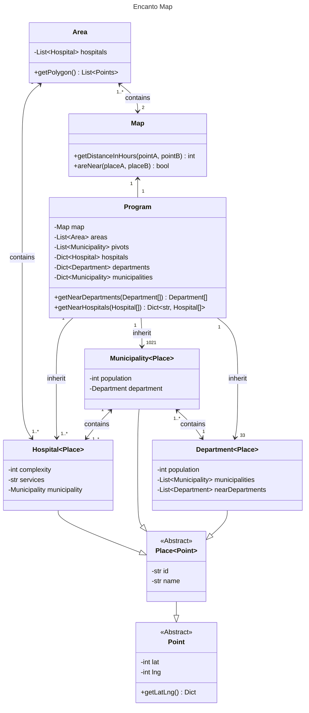

```mermaid
---
title: Encanto Map
---
classDiagram

    direction TB

    class Point {
        <<Abstract>>
        -int lat
        -int lng

        +getLatLng() Dict
    }

    class Place~Point~ {
        <<Abstract>>
        -str id
        -str name
    }

    class Hospital~Place~ {
        -int complexity
        -str services
        -Municipality municipality
    }

    class Municipality~Place~ {
        -int population
        -Department department
    }

    class Department~Place~ {
        -int population
        -List~Municipality~ municipalities
        -List~Department~ nearDepartments
    }

    class Area {
        -List~Hospital~ hospitals
        +getPolygon() List~Points~
    }

    class Map {
        +getDistanceInHours(pointA, pointB) int 
        +areNear(placeA, placeB) bool
    }

    class Program {
        -Map map
        -List~Area~ areas
        -List~Municipality~ pivots
        -Dict~Hospital~ hospitals
        -Dict~Department~ departments
        -Dict~Municipality~ municipalities
        +getNearDepartments(Department[]) Department[]
        +getNearHospitals(Hospital[]) Dict~str, Hospital[]~
    }

    Hospital --|> Place
    Municipality --|> Place
    Department --|> Place
    Place --|> Point

    Area "1..*" <--> "2" Map : contains

    Area "1" <--> "1..*" Hospital : contains

    Municipality "1..*" <--> "1" Department : contains

    Program "1" --> "1..*" Hospital : inherit

    Municipality "1" <--> "1..*" Hospital : contains

    Program "1" --> "1021" Municipality : inherit

    Program "1" --> "33" Department : inherit

    Map "1" <-- "1" Program

```